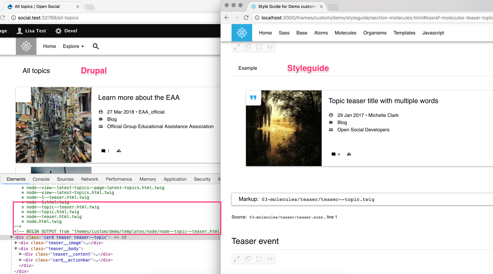

# Demo custom Drupal subtheme integrated with KSSNode as a living styleguide
**Uses socialBase as base theme (which uses bootstrap as a base theme)**

### *Essential reading for background and links to related resources here:[Creating a Living Style Guide with Open Social](https://www.getopensocial.com/blog/open-source-technology/creating-living-style-guide-open-social)

## Intent

The main intent of this repo is to provide a proof of concept for a 
custom Drupal subtheme using a living styleguide.

The teaser molecules and the hero organisms are currently the only components
 that are "living" (used directly by the drupal theme and the styleguide). 
 They are made up of some atoms. The drupal theme template overrides 
 demonstrate how we can map twig variables in the styleguide to the drupal data.
 
The hero components include 4 types.
 
 1. the content type hero component (topic, events)
 1. the group entity hero component
 1. the profile entity hero component
 1. the hero section from the social_landing_page (example of how to integrate 3rd party module)
  
Visually and structurally they are all quite similar.
 
## Motivations

1. Reduce inconsistency due to having either multiple developers, and/or 
multiple contexts (example of context = hero component on profile versus on topic) without a good understanding of the holistic picture. The end-user and client don’t care about implementation. As developers we should have good reasons for differences in implementation between two seemingly similar components. "Another developer did it" is not 
a great reason.

1. Enable frontend development to start while development is ongoing (instead 
of being dependent on it)

1. Enable design to continue beyond static mockups and wireframes

1. Study and document patterns of OpenSocial to achieve a better holistic 
understanding and enable the other people involved in the project to do the same (designer, backend developer, project manager, client, community manager etc)

## Benefits

1. Styleguides and component libraries display the current status of design 
components

1. And can also display possibilities. Think about displaying all available 
data first, and reducing elements as a design process. And how it 
can enable the designer, developers, client

1. Comparing something side by side (eg. hero on node versus hero on landing page) - Does the implementation differ due to technical constraints or due to a lack of holistic perspective

1. Leverages the idea of the ‘Master’ in print
Graphics programs can easily introduce discrepancies in designs due to a lack of holistic perspective (i.e when an instance of an element changes, should all instances change, or just that one? And how should that be communicated to the developers / client etc)

1. Enables designing-in-the-browser. Frees the designer from the constraints of graphics programs reproducing what will eventually be code, and means designer can contribute directly to the FED

1. Headless drupal could mean removing Drupal render array / variables and 
plugging in another data source

## How-to

1. Install and enable **Component Library** Drupal module
*Required: https://www.drupal.org/project/components (See: Why use a custom 
Twig namespace?)

1. Clone this repo 
`git clone git@github.com:left23/open_social_living_style_guide.git demo`
into you custom theme folder (*Note: the theme name **Demo**). Set as default 
theme

1. Follow set up instructions here (from socialBlue theme): https://github.com/goalgorilla/open_social/blob/8.x-1.x/themes/socialblue/readme.md#getting-started-with-your-sub-theme

1. Follow temporary instruction relating to installing the right 
twig-drupal-filters package. See troubleshooting section below

1. Examine the gulpfile.js. This tells us a lot about the architecture and 
process. See diagram above

1. Run `gulp watch` and hopefully you'll see the styles being 
compiled to demo/assets/ and a demo/styleguide folder being created and 
filled with html and css

1. You can check the twig debug to verify the templates are coming from the 
demo theme, and you can visit http://localhost:3000/themes/custom/demo/styleguide

**Teasers**: http://localhost:3000/themes/custom/demo/styleguide/section-molecules.html#kssref-molecules-teaser

**Hero**: http://localhost:3000/themes/custom/demo/styleguide/section-organisms.html#kssref-organisms-hero

## Known Issues

1. **Drupal Attributes:**
[@Kingdutch](https://github.com/Kingdutch) added an attributes object with an
 addClass method to this styleguide’s os-builder.js (based on this: https://github.com/ericmorand/drupal-attribute). 
 Alexander also opened a issue for the attributes object to be included in KSS 
 Node https://github.com/kss-node/kss-node/issues/451

1. **Ternary operators:**
It brought to light another issue with ternary operators documented here:
https://github.com/twigjs/twig.js/issues/507
(See Alexander’s example)
*Note: Due to this issue, I removed any ternary operators in favour of 
conditions (not as nice)

1. **twig-drupal-filters**
[@Kingdutch](https://github.com/Kingdutch) forked an existing package (a 
dependency of KSSNode) and 
extended it to incorporate the `` Drupal twig function. The package 
isn't being replaced correctly, despite the resolution declaration in `package
.json`. You might notice the function folder isn't present after you run `yarn 
install`.
 I cloned it directly from here https://github.com/goalgorilla/twig-drupal-filters into the node_modules folder

## Troubleshooting

1. If you get an error like: `Twig_Error_Loader: Template @demo/04-organisms/hero/hero.twig is not defined (Drupal\Core\Template\Loader\ThemeRegistryLoader: Unable to find template in the Drupal theme registry.) in themes/custom/demo/templates/paragraph/paragraph--hero--default.html` check 
that you have enabled components module. See how-to step 1.

1. Understand what is compiling, and to where. And how it is being attached 
to the page (Drupal library versus kss-assets, for example). If something isn't 
displaying as expected, look for its absence to start ruling out factors in 
the render process. If it works in Drupal but not in the styleguide (or visa 
versa) this indicates where along the process issues might be occurring. Good
 luck :)
 